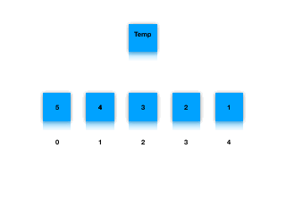

# 排序算法

## 简单排序

+ ### 冒泡排序

1. 对一组`无序的数组`，进行两两比较，根据大小交换位置，直到最后将最大(小)的数据交换到数据尾部变成`有序数组`，从而完成一次冒泡。

2. 重复上面的步骤,直到所有的元素变为有序数

        ```js
        function bubbleSort(){
            let len = arr.len;
            for(let i = 0; i < len; i++){
                for( j = 0; j< len-i; j++){
                    if(arr[j]>arr[j+1]]){
                        [arr[j],arr[j+1]] = [arr[j+1],arr[j]]
                    }
                }
            }
        }
        ```

+ ### 选择排序

1. 从数组的开头开始，将第一个元素和其他的元素比较，将最小的元素放在开头。

2. 然后从第二元素开始和后面的元素进行比较，将最小的元素放在第二个位置。

3. 重复上面过程，直到排序完成

        ```js
        function selectionSort(arr) {
        //min来标记最小元素的位置
            let min, len = arr.length;
            for (let i = 0; i<= len - 2; i++){
                for(let j= i+1; j<=i -1; j++) {
                    if(arr[j] <= arr[i]){
                        min = j;
                    }
                }
                [arr[min], arr[i]] = [arr[i], arr[min]]
            }
            return arr
        }
        ```

+ ### 插入排序

1. 通过构建有序序列，对于未排序数据，在已排序序列中从后向前扫描，找到相应位置并插入。具体看下面git

    

2. 将要比较的元素赋值给`temp`,将已经排序好的元素跟`temp`进行比较,如果大于`temp`就将该元素右移动,为`temp`让出位置.

    ```js
        function (arr) {
            let temp, j,
                len = arr.length;
            for (let i = 1; i <= len - 1; i++){
                temp = arr[i];
                j= i;
                while(j > 0 && arr[j - 1] > temp){
                    arr[j] = arr[j - 1]
                    j--;
                }
                arr[j] = temp;
            }
            return arr;
        }
    ```

## 高级排序

+ ### 希尔排序

1. 回顾一下插入排序，每次比较的都是相邻的两个数，当元素距离它正确的位置较远的时候需要循环多次才可以到达正确位置。希尔排序则则是比较`较远`的元素，这样会使较远的元素快速回到合适的位置。

2. 那么这个`较远`到底是多远，由什么来定义呢，希尔排序定了`间隔序列`，来表示排序过程中进行比较的元素的有多远。当这个间隔序列为1的时候也就是插入排序了。

```js
function shellSotr(arr){
    let h = 1,
        len = arr.length;
    while(h < len){
        h = 3*h + 1;
    }
    while(h >= 1){
        for(let i = h; i < len; i++){
            for(let j = i; j >= h&& arr[j] < arr[j-h]; j -=h){
                [arr[j],arr[j-h]] = [arr[j-h], arr[j]]
            }
        }
        h = (h -1)/3
    }
}
```